# 《人均嬴政白皮书》

**智能棺材全栈物联网教学平台**

> **编者**：沪上嘻嘻生
>
> **座右铭**：讲好棺材故事，贡献棺材方案，享受棺材人生

---

## ⚰️ 序言：向死而生 (Prologue)

### 1. 棺材板盖不住继续盖
**实时监控棺材板，讨论信息社会责任：**
*   有摄像头监控棺材好不好？
*   棺材内部温湿度是否合理？
*   是否需要加入继电器控制空调？

有人问：“私人还要监管内部吗，这不合理。”
**那我请问了，秦始皇陵墓怎么造的？** 智能棺材要建立防御机制，从而引出物联网核心概念——**反馈机制**：
`输入 (Input) → 处理 (Process) → 输出 (Output) → 反馈 (Feedback)`

### 2. 价值观的终极思考
有人又要说了，天天棺材的不符合积极向上的价值观。
那我说“天天向上”，停下来就要掉下来了。上句“奋力一跃”，下句“直笔笔落地成盒”。
所以要有**危机意识**，有**长远的发展规划**，用发展的眼光看待世界，**直接看到终点，世界的尽头**。

---

## 🌟 核心功能亮点

本项目不仅仅是一个静态的课程展示，更是一个集成了 **AI 生成**、**社区互动** 与 **二创生态** 的全栈平台。

### 1. 🤖 AI 智能教案生成 (RAG 2.0 驱动)
摒弃千篇一律的模板，每一份教案都是现场“通灵”生成。
*   **个性化定制**：支持输入“自定义咒语”，让 AI 根据你的特殊需求调整教案风格（例如：“让风格更阴间一点”或“强调网络安全”）。
*   **RAG 2.0 (精准检索增强)**：
    *   **层级化索引 (Hierarchical Indexing)**：不再使用传统的全文切片，而是基于 PDF 文档结构（年级-单元-课）构建知识图谱。
    *   **元数据硬过滤 (Metadata Filtering)**：生成教案时，系统会瞬间锁定对应年级和单元的教科书内容，排除 90% 的无关干扰。
    *   **双重检索算法**：结合硬过滤与标题模糊匹配，确保 AI 获得的上下文既精准又完整，生成速度提升 300%。

### 2. 🏆 冥界封神榜 (Leaderboard)
这是一个展示优秀教案的社区排行榜。
*   **实时排名**：根据点赞数（🔥 Hot）、二创数（🍴 Remix）和发布时间（🕒 New）进行排序。
*   **互动点赞**：用户可以为喜欢的教案点赞（点亮爱心），数据实时同步至 Supabase 数据库（需登录）。
*   **详情预览**：点击任意条目，即可在弹窗中预览完整的 Markdown 教案内容。

### 3. 🍴 教案二创 (Remix System)
开源精神的终极体现——**Fork & Modify**。
*   **一键二创**：在排行榜或详情页点击“以此为基础二创”，即可将该教案的内容完全复制到编辑器中。
*   **知识库回溯**：即使在二创模式下，AI 依然能够通过反查知识库，调用原书对应的知识点作为参考，确保二创不偏离教学大纲。
*   **版本溯源**：二创后的教案在数据库中标记为 Remix 版本。

### 4. 💀 个人档案与生命周期管理 (Profile)
每个用户都拥有自己的“生死簿”。
*   **草稿箱**：生成的教案如果不满意或未完成，可以先保存为“草稿”，仅自己可见。
*   **发布与撤销**：一键将满意的教案发布到“封神榜”；如有悔意，也可随时“撤销发布”，将其拉回草稿箱。
*   **销毁数据**：对于彻底不满意的作品，支持物理层面的“销毁”（从数据库永久删除）。

---

## 👁️ 页面预览 (Visual Tour)

### 1. 陵墓入口 (The Mausoleum)
赛博朋克风格的视觉入口，动态光标与流体背景。
<div align="center">
  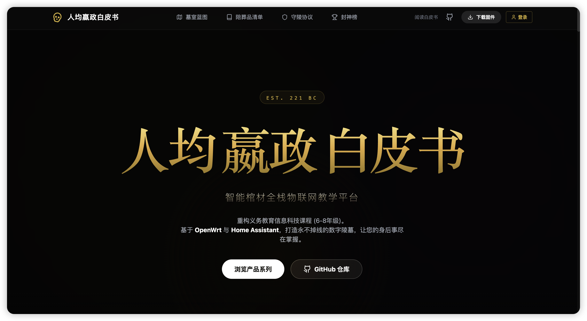
</div>

### 2. 陪葬品清单 (Product Showcase)
展示 OpenWrt 网关、智能中枢等核心硬件。
<div align="center">
  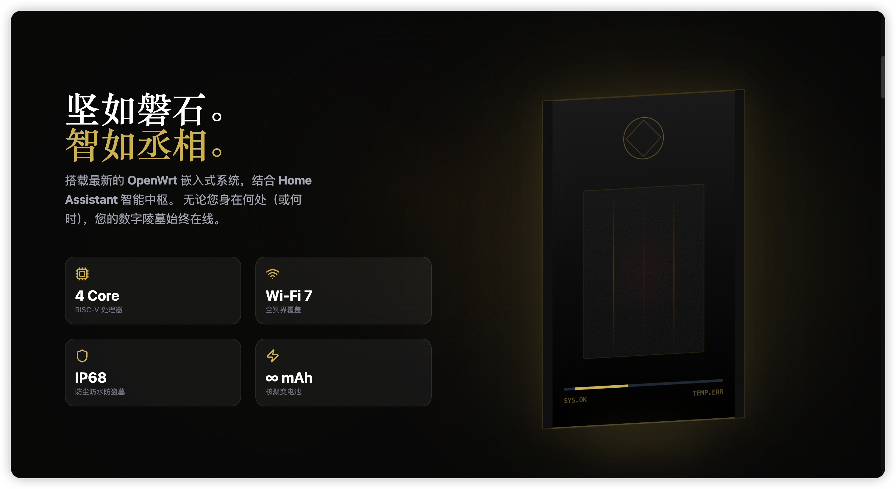
</div>

### 3. 系统架构 (System Architecture)
全栈物联网解决方案，从传感器到云端。
<div align="center">
  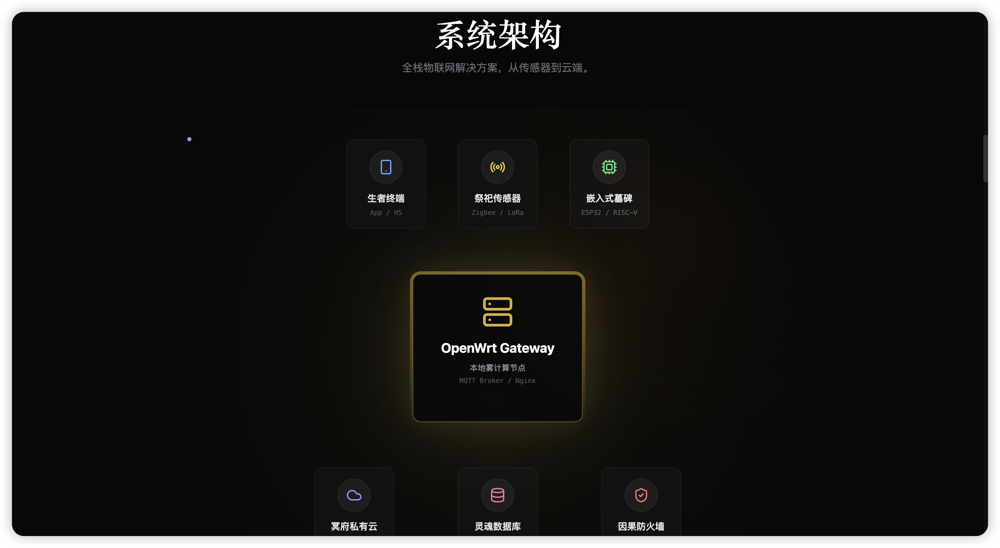
</div>

### 4. 课程大纲 (Curriculum Matrix)
左侧 Spotlight 视觉索引，右侧详情列表。
<div align="center">
  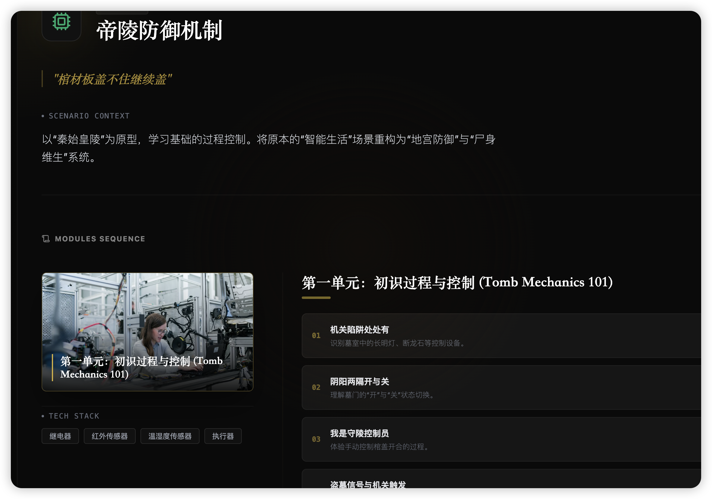
</div>

### 5. 课程详情与 AI 生成 (Lesson Detail)
沉浸式教学详情页，包含 **RAG 增强** 的 AI 教案生成功能。
<div align="center">
  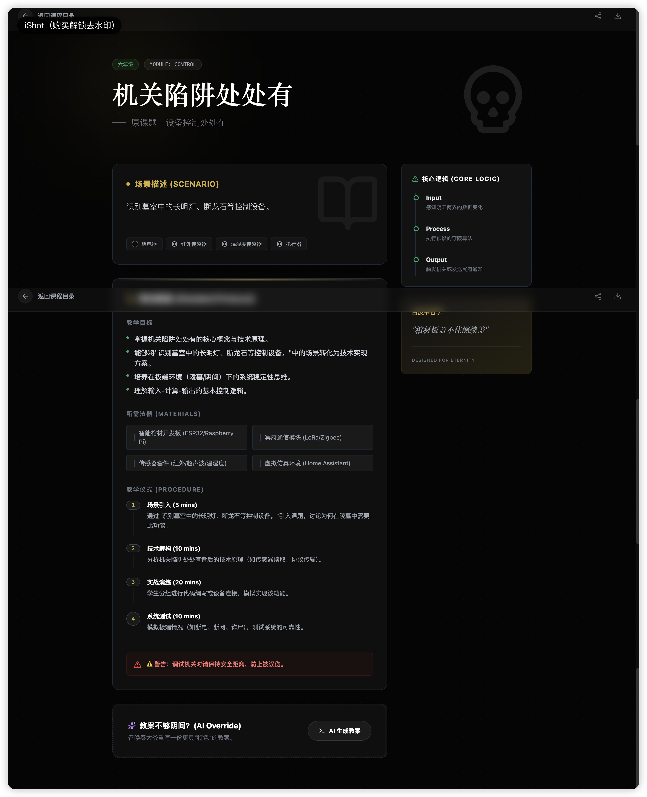
</div>

### 6. 封神榜 (Leaderboard)
展示优秀教案的社区排行榜。
<div align="center">
  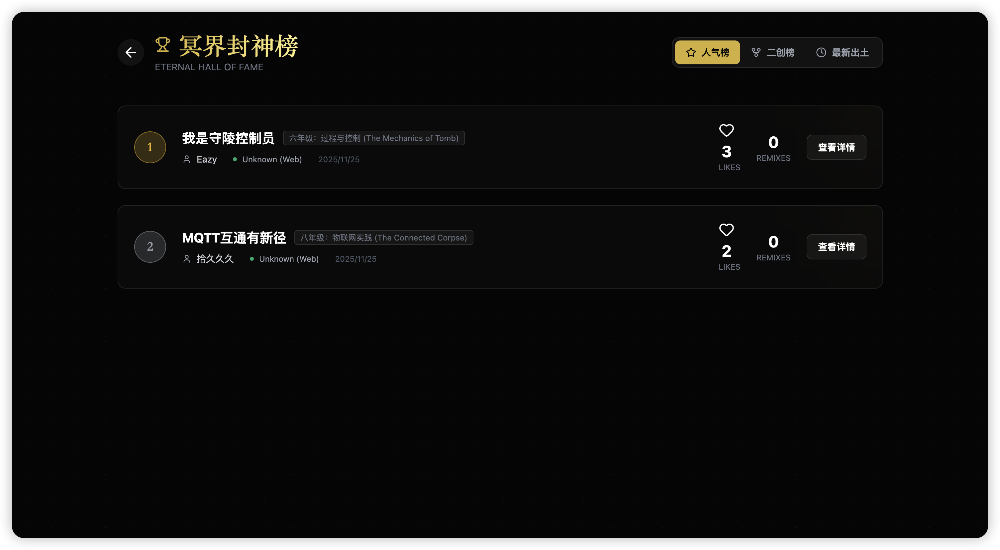
</div>

### 7. 二创编辑器 (Remix Editor)
基于现有教案进行二次创作。
<div align="center">
  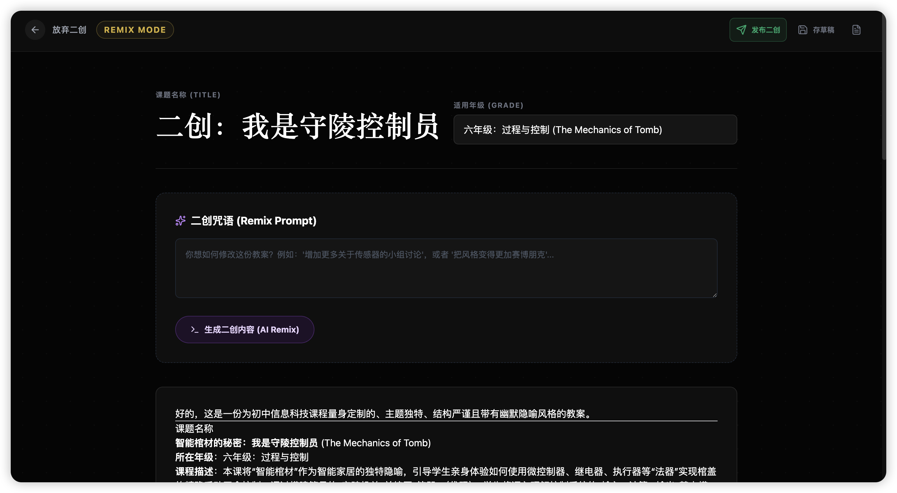
</div>

### 8. 通灵协议 (Oracle Protocol)
与数字灵魂对话的 AI 接口。
<div align="center">
  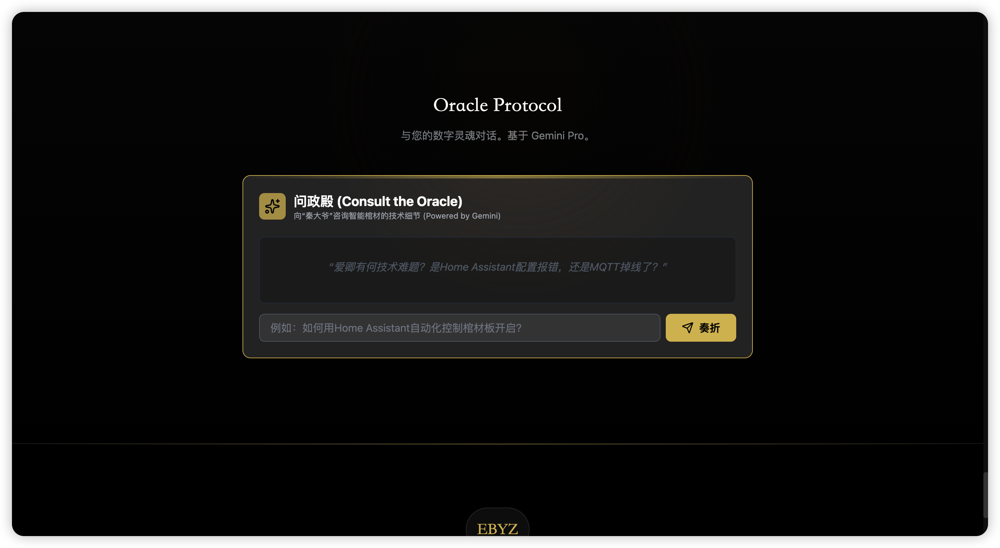
</div>

### 9. 冥府终端登录 (Login)
支持 Google, GitHub, Magic Link 多种登录方式。
<div align="center">
  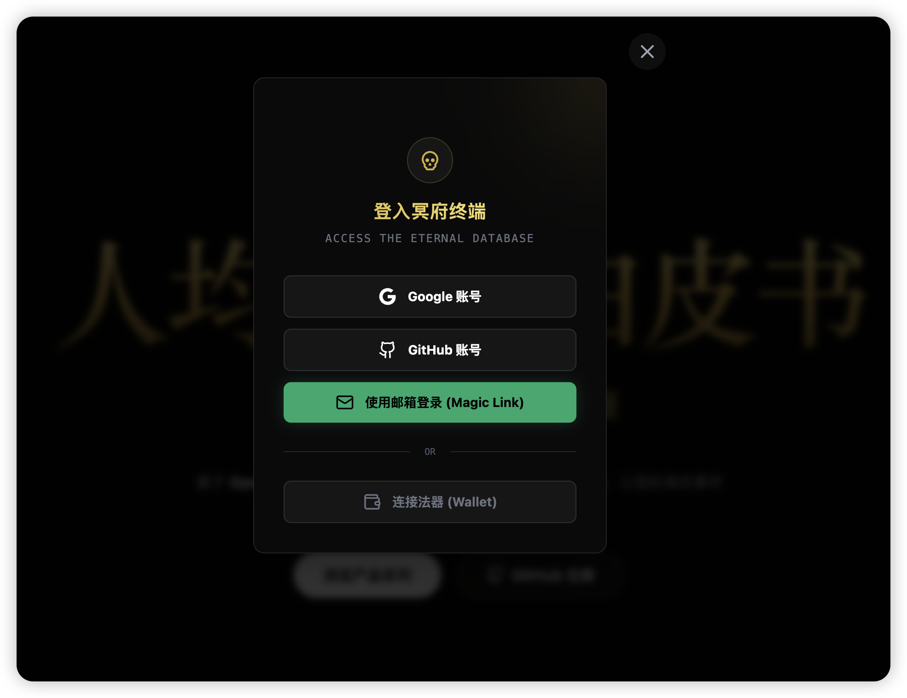
</div>

### 10. 法律与服务条款 (Legal)
隐私政策、冥界条款、固件更新、联系方式。
<div align="center">
  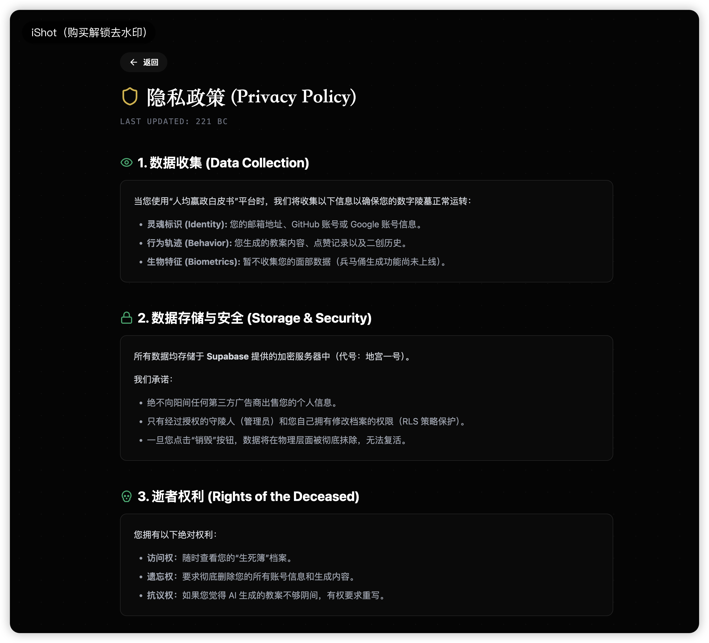
  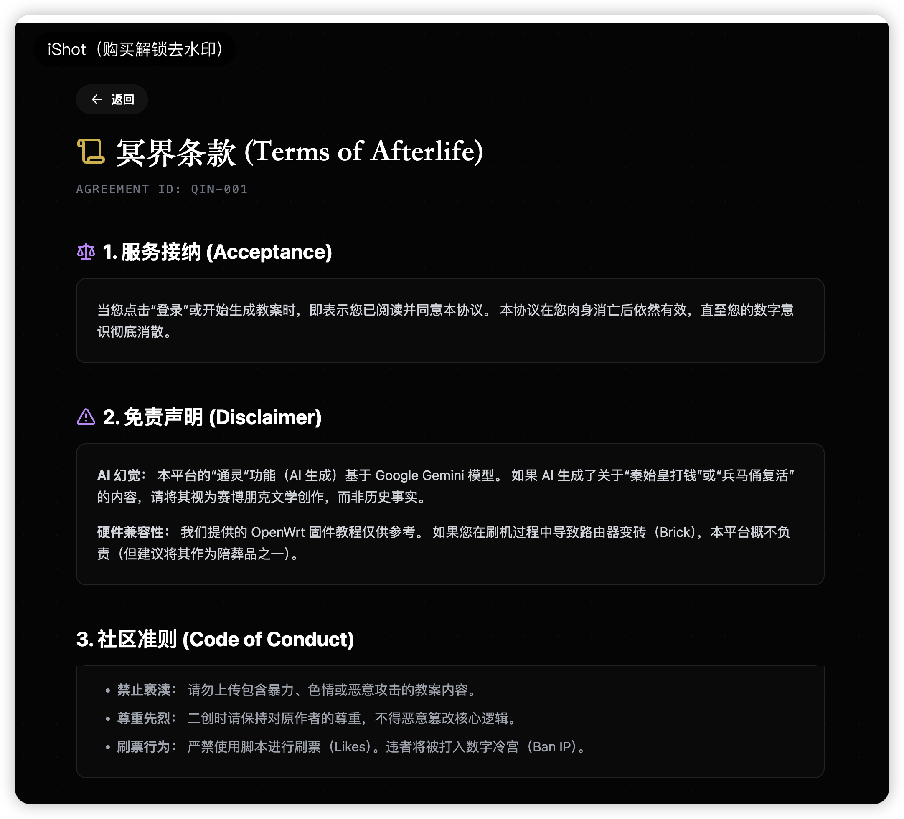
  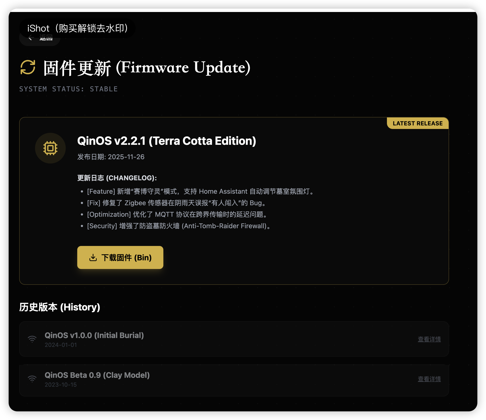
  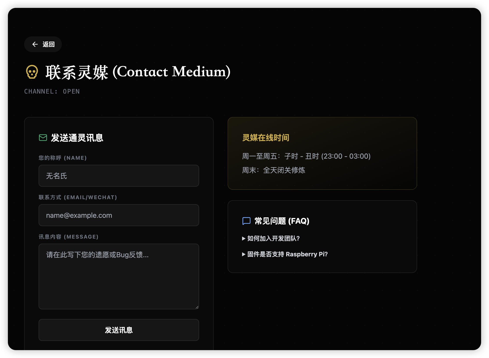
</div>

---

## 🛠️ 运行项目

**环境要求：** Node.js

### 本地开发

1. 安装依赖：
   ```bash
   npm install
   ```
2. 设置环境变量：
   - 创建 `.env.local` 文件
   - 设置 `VITE_GEMINI_API_KEY` (AI功能) 和 Supabase 相关 Key (后端数据库)
   ```env
   VITE_GEMINI_API_KEY=your_api_key_here
   VITE_SUPABASE_URL=your_supabase_url
   VITE_SUPABASE_ANON_KEY=your_supabase_anon_key
   ```
3. 运行开发服务器：
   ```bash
   npm run dev
   ```

### 构建知识库 (RAG)
如果更新了 `knowledge_base/` 下的 PDF 文件，需要重新生成索引：
```bash
npm run extract
```

### 构建生产版本
```bash
npm run build
```

## 🧱 技术栈

- **Core**: React 19, TypeScript, Vite
- **Backend (BaaS)**: Supabase (PostgreSQL, Auth, Realtime)
- **AI & RAG**: 
  - Google Generative AI SDK (Gemini 2.5 Flash)
  - PDF Parsing & Text Extraction
  - Context Injection
- **Styling**: Tailwind CSS, Framer Motion (Animations)
- **Utilities**: React Markdown, Lucide Icons

## 📄 许可证

[MIT License](LICENSE)